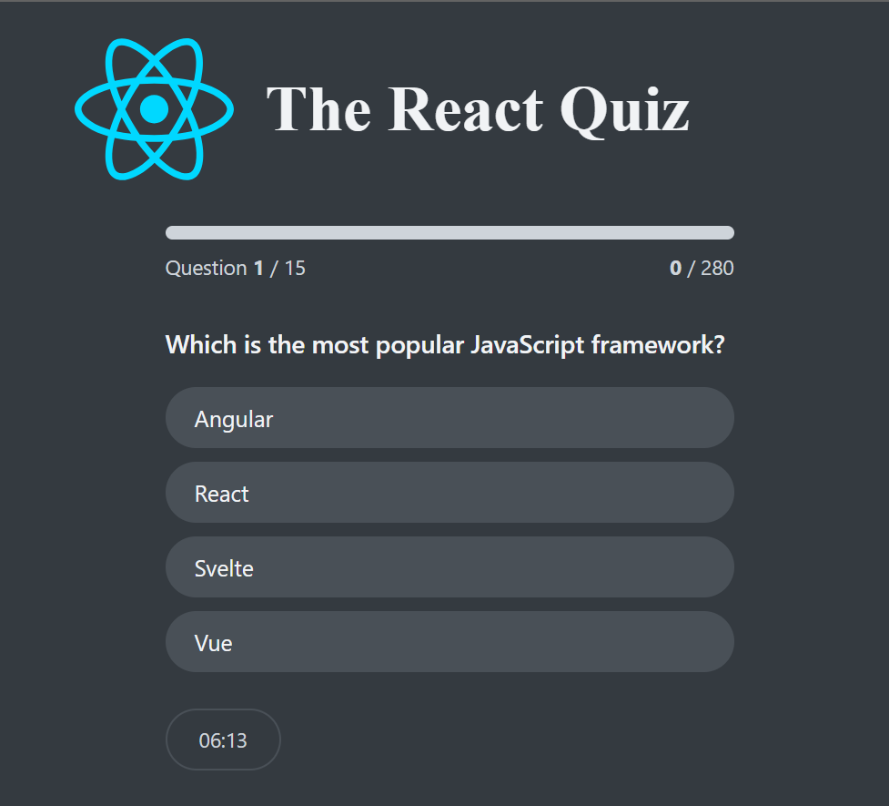
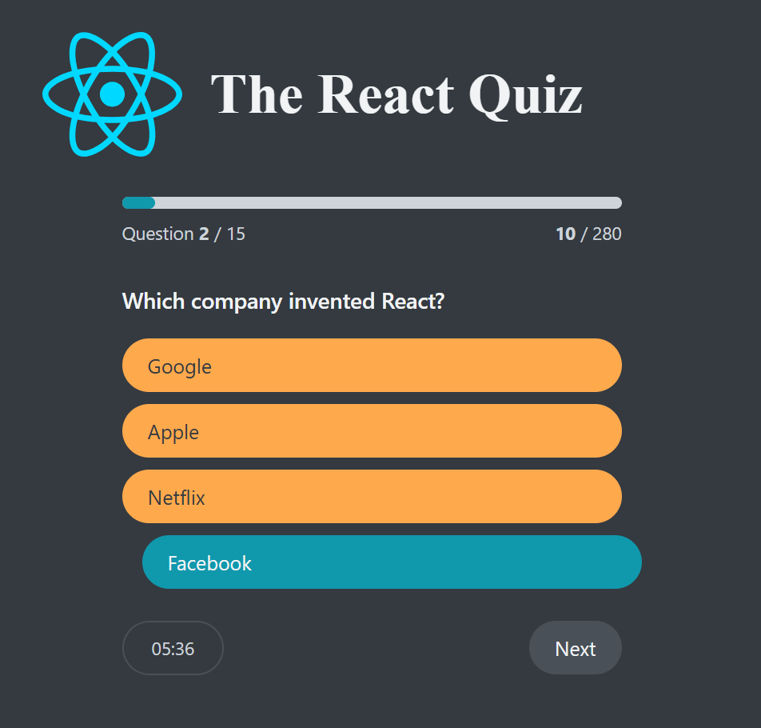
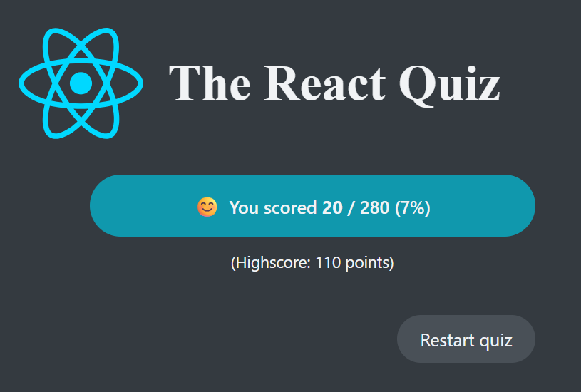

# React Quiz

A lightweight React app where you take a timed quiz, get instant feedback for each answer, and see your final score (with a saved high score in `localStorage`).

<p align="center">
  
</p>

## ✨ Features

- **Start a quiz** and answer multiple‑choice questions.
- **Instant feedback**: each selection is marked as correct or wrong immediately.
- **Timer**: a **time limit** to finish the quiz; the remaining time is shown during play.
- **Final results**: total correct answers and **score** at the end.
- **High score**: persisted using **`localStorage`** (kept between sessions).
- **Restart**: reset the quiz and try again.
- **Fake API**: questions are fetched from a local JSON API (via **JSON Server**).

<p align="center">
  
</p>

<p align="center">
  
</p>

## 🧰 Tech Stack

- **React 18** for UI ([react.dev](https://react.dev/))
- **Vite** for dev server & bundling ([vitejs.dev](https://vitejs.dev/))
- **JSON Server** for a local fake REST API ([github.com/typicode/json-server](https://github.com/typicode/json-server))
- **Web Storage API** for high score ([MDN: Web Storage API](https://developer.mozilla.org/docs/Web/API/Web_Storage_API))

## 🚀 Getting Started

> Make sure you have **Node.js** installed (LTS is recommended). You can download it from [nodejs.org](https://nodejs.org/).

1. **Install dependencies**
   ```bash
   npm install
   ```

2. **Start the fake API** (JSON Server)
   ```bash
   npm run server
   ```
   - This serves your quiz questions from a local endpoint (commonly `http://localhost:3000/` or similar, depending on your `package.json`/config).  
   - Keep it running while you develop/test the app.

3. **Run the app**
   ```bash
   npm run dev
   ```
   - Open the printed local URL (usually `http://localhost:5173/`) to use the app.

## 🗂️ Project Notes

- **Questions data**: stored in a JSON file and served by JSON Server. You can edit the JSON to add or change questions.
- **High score**: saved under a key in `localStorage` (e.g., `highscore`) so it persists between page reloads.
- **Timer**: the quiz must be completed before time runs out—otherwise it ends automatically (implementation‑dependent).

## 📜 Available Scripts

- `npm run server` – starts JSON Server (fake API).
- `npm run dev` – starts the Vite development server.
- `npm run build` – builds the production bundle (if set up in your `package.json`).

## 🔧 Troubleshooting

- **API not loading / empty questions**  
  Ensure the JSON Server is running **before** starting the dev server: `npm run server` then `npm run dev`.
- **Port already in use**  
  Stop any previous instance of JSON Server/Vite or change the port in your scripts.
- **High score not updating**  
  Clear `localStorage` from DevTools (Application → Storage) and try again.

## 📚 References

- React docs – components, state & effects: https://react.dev/learn  
- Vite guide – getting started: https://vitejs.dev/guide/  
- JSON Server – quick start: https://github.com/typicode/json-server#readme  
- MDN – `localStorage`: https://developer.mozilla.org/docs/Web/API/Window/localStorage  
- MDN – setTimeout/interval (timers): https://developer.mozilla.org/docs/Web/API/setTimeout

---

**License**  
This project is for learning/demo purposes. Feel free to adapt the README to match your codebase and license.